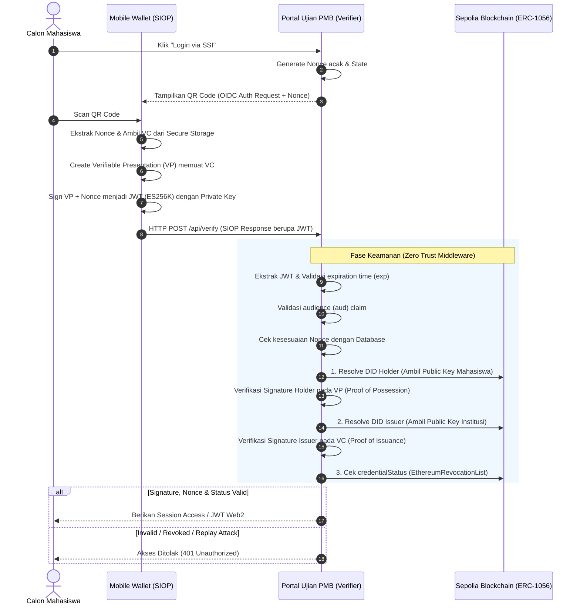

# Alur Autentikasi SIOPv2 (Self-Issued OpenID Provider v2)
Dokumen ini mendefinisikan protokol SSO desentralisasi antara Portal Ujian PMB (Verifier) dan Mobile Wallet (Holder) guna mencegah penyalahgunaan akses dan memastikan keabsahan kredensial.

Protokol ini secara ketat mengikuti spesifikasi **Self-Issued OpenID Provider v2 (SIOPv2)** di mana Wallet bertindak secara mandiri sebagai *Identity Provider* (IdP) yang dikontrol langsung oleh pengguna tanpa perantara server pusat.

## Sequence Diagram

## Mekanisme Pencegahan Replay Attack
*Replay Attack* adalah serangan di mana peretas menyadap respons JWT dari jaringan dan mencoba mengirimkannya kembali di masa depan untuk melakukan login ilegal. Sistem ini mencegahnya melalui alur parameter `nonce`:

1. **Pembuatan Nonce**: Portal Ujian PMB (Verifier) men-generate `nonce` kriptografis satu kali pakai (*one-time string*) yang unik untuk setiap permintaan login dan menyimpannya di cache/database dengan masa berlaku sangat singkat (misal: 2 menit).

2. **Keterikatan Tanda Tangan (Cryptographic Binding)**: Wallet WAJIB memasukkan *nonce* tersebut ke dalam payload *Verifiable Presentation* (VP) sebelum ditandatangani oleh *private key* pengguna menjadi JWT.

3. **Validasi Ketat**: Saat Verifier menerima JWT, middleware akan mengekstrak `nonce`, mencocokkannya dengan database, dan **segera menghapus (invalidate)** `nonce` tersebut. Jika peretas mengirim ulang JWT yang sama, Verifier otomatis menolak akses karena *nonce* telah hangus.

## Validasi Keamanan Tambahan (Multi-Layer Verification)
Selain perlindungan *nonce*, *Zero Trust Middleware* pada Verifier juga mengeksekusi lapis keamanan berikut sebelum memberikan akses sesi:

1. **Audience Validation (`aud`)**: Memastikan bahwa JWT otentikasi tersebut memang ditujukan secara spesifik untuk *client_id* Portal Ujian PMB, mencegah token disalahgunakan di sistem kampus lain.

2. **Expiration Validation (`exp`)**: Mencegah penggunaan token otentikasi setelah batas waktu respons berakhir.

3. **Credential Expiration Check**: Memastikan atribut `expirationDate` yang tertanam di dalam *Verifiable Credential* (VC) masih berlaku (misalnya, masa PMB belum berakhir).

4. **DID Resolution & Revocation Check**: Memastikan kunci publik yang digunakan untuk memverifikasi tanda tangan adalah versi terbaru dari *registry on-chain*, dan mengekstrak status kredensial (*EthereumRevocationList*) untuk memastikan identitas belum dibekukan atau dicabut oleh institusi.